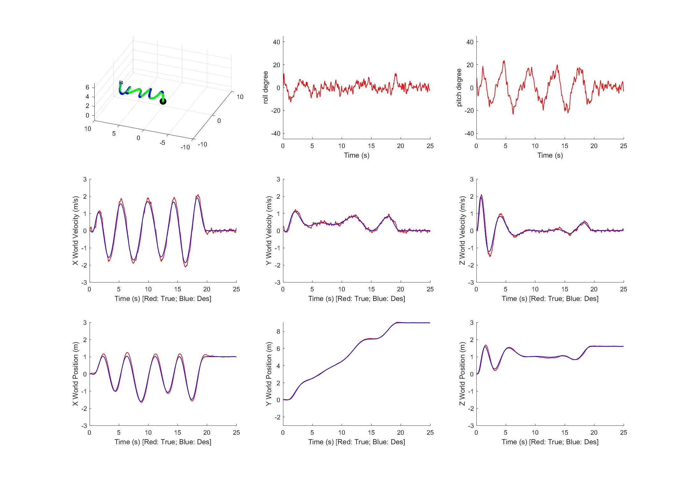
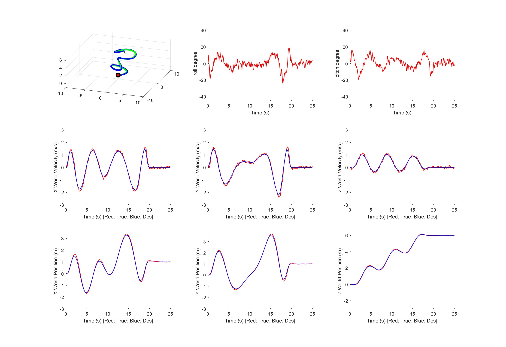
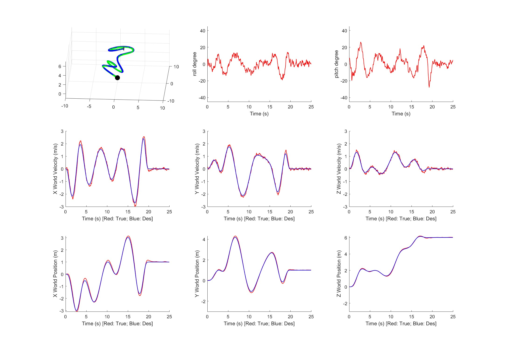
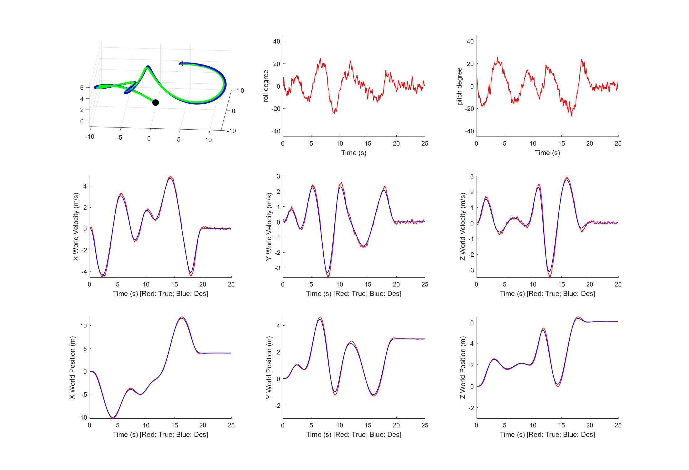

# Project 1 - Phase 2: Trajectory Planning and Generation

## Trajectory Generation Method

- The trajectory is generated using an optimization-based method (minimum snap trajectory generation). In the actual coding implementation, the built-in function `quadprog` from MATLAB is used to solve the constrained Quadratic Programming problem.
- The time allocation is proportional to the length of each segment of the trajectory (weighted average).
- At the end of the trajectory, the Quadrotor will hover with the final state if the experiment is still ongoing.

## Simulation Figures

Path1

Path2

Path3 (self-designed)

Path4 (self-designed)

## Controller Statistics

The Controller's parameters have been optimized based on Project1-Phase1. Currently, the parameters' values are:

|     | X_pos | Y_pos | Z_pos | Roll_att | Pitch_att | Yaw_att |
| --- | ----- | ----- | ----- | -------- | --------- | ------- |
| Kp  | 10    | 10    | 10    | 3000     | 3000      | 3000    |
| Kd  | 8     | 8     | 8     | 100      | 100       | 100     |
| Ki  | 1     | 1     | 1     | 1        | 1         | 1       |

The performances on different paths based on RMSE values:

| RMSE                | Path1    | Path2    | Path3    | Path4   |
| ------------------- | -------- | -------- | -------- | ------- |
| RMSE Position (m)   | 0.077445 | 0.070551 | 0.084609 | 0.12952 |
| RMSE Velocity (m/s) | 0.13065  | 0.10243  | 0.12858  | 0.16033 |
| RMSE Yaw (deg)      | 1.3341   | 1.3232   | 1.3302   | 1.3326  |

## Result Analysis

After the optimization of the Controller, the path following becomes smoother and more stable. The trajectory generation is also acceptable.

## Others

- The `Path3` and `Path4` waypoints should be found in the `test_trajectory.m`.

## Reference

Parts of implementation is referred to - https://github.com/Garyandtang/ELEC5660-2021/tree/main/project1/proj1phase2/code
